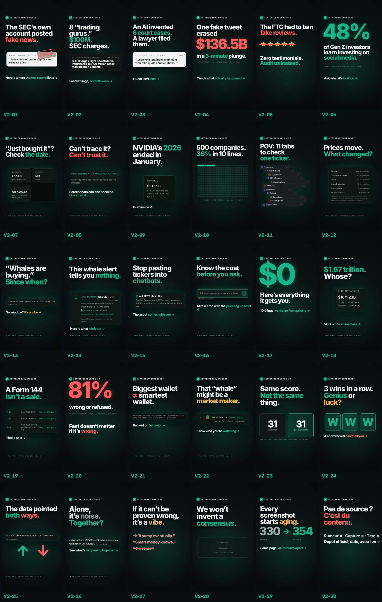

# BFYP VAULT V2 — 30 Reels, READY

New stock of 30 Instagram/TikTok-style Reels for BetterForYourPocket, to be published **after 30 Sep 2026**. Nothing here is scheduled: the Buffer queue, `public/social/buffer/` and any planned distribution were not touched.

**Status: 30/30 READY** · 23 text-led · 7 voice-led (fallback voice, see below) · 29 EN + 1 FR · 20.0–28.4 s · −14.8 to −14.1 LUFS · true peak ≤ −1.06 dBTP · 293 MB total

Every reel follows **problem → why it hurts → proof → BFYP solution → CTA**, uses only real BFYP screens (captured 23 Sep 2026, capture time stamped on screen), cites verifiable external sources where it uses any outside fact, and ends on the CTA plus “Educational market data. Not financial advice.”

## How to use

Each folder in `READY/` contains:

- `V2-XX_slug-<sha>.mp4`: the final Reel (1080×1920, 30 fps, H.264 High, AAC 48 kHz stereo, −14 LUFS, ≤ −1 dBTP)
- `V2-XX_slug_cover-<sha>.png`: the cover (1080×1920; key text sits inside the 3:4 profile-grid area)
- `V2-XX_slug.md`: the deliverable sheet with internal title, angle, beat-by-beat script and on-screen text, voice-over (if any), sources, BFYP assets with capture times, illustrations, Instagram caption, X caption, hashtags, CTA, optional sources comment, and the QC report

File names are content-addressed (`-<first 10 hex of sha256>`), like the rest of this repo. `manifest.json` lists every file with its full sha256.

## Index

| # | Reel | Lot | Format | Length | Opening hook (from 0 s) |
|---|---|---|---|---:|---|
| V2-01 | [Even the SEC got faked](READY/V2-01_sec_hack/V2-01_sec_hack.md) | 1 | Text-led | 21.4 s | The SEC’s own account posted fake news. |
| V2-02 | [Follow filings, not followers](READY/V2-02_gurus_100m/V2-02_gurus_100m.md) | 1 | Text-led | 20.6 s | 8 “trading gurus.” $100M. SEC charges. |
| V2-03 | [Fluent isn't true](READY/V2-03_ai_fake_cases/V2-03_ai_fake_cases.md) | 1 | Text-led | 20.8 s | An AI invented 6 court cases. A lawyer filed them. |
| V2-04 | [One fake tweet, $136.5B](READY/V2-04_fake_tweet/V2-04_fake_tweet.md) | 1 | Text-led | 22.0 s | One fake tweet erased $136.5B. |
| V2-05 | [No testimonials. On purpose.](READY/V2-05_fake_reviews/V2-05_fake_reviews.md) | 1 | Text-led | 20.4 s | The FTC had to ban fake reviews. |
| V2-06 | [48% learn investing on social](READY/V2-06_feed_48/V2-06_feed_48.md) | 1 | Text-led | 20.4 s | 48% of Gen Z investors learn investing on social media. |
| V2-07 | [“Just bought” — just?](READY/V2-07_just_bought/V2-07_just_bought.md) | 1 | Text-led | 20.8 s | “Big fund just bought $XYZ!” “Just”? |
| V2-08 | [Can’t trace it? Can’t trust it.](READY/V2-08_trace_it/V2-08_trace_it.md) | 1 | Text-led | 20.0 s | This is a screenshot. |
| V2-09 | [NVIDIA’s 2026 ended in January](READY/V2-09_fiscal_2026/V2-09_fiscal_2026.md) | 1 | Text-led | 20.4 s | When did NVIDIA’s fiscal 2026 end? |
| V2-10 | [500 companies. 36% in 10 lines.](READY/V2-10_top10_36/V2-10_top10_36.md) | 1 | Text-led | 21.0 s | You bought 500 companies. |
| V2-11 | [POV: 11 tabs for one ticker](READY/V2-11_eleven_tabs/V2-11_eleven_tabs.md) | 2 | Text-led | 21.0 s | POV: 11 tabs to check one ticker. |
| V2-12 | [Prices move. What changed?](READY/V2-12_what_changed/V2-12_what_changed.md) | 2 | Text-led | 20.4 s | Your dashboard, all day: GREEN. RED. It shows prices. Not what changed. |
| V2-13 | [“Whales are buying.” Since when?](READY/V2-13_since_when/V2-13_since_when.md) | 2 | Voice (fallback) | 25.2 s | “Whales are buying!” Since when? |
| V2-14 | [This whale alert tells you nothing](READY/V2-14_whale_alert/V2-14_whale_alert.md) | 2 | Text-led | 20.0 s | This whale alert tells you nothing. |
| V2-15 | [Stop pasting tickers into chatbots](READY/V2-15_context_paste/V2-15_context_paste.md) | 2 | Text-led | 20.6 s | Copy. Paste. Explain. Repeat. |
| V2-16 | [Know the cost before you ask](READY/V2-16_cost_before/V2-16_cost_before.md) | 2 | Text-led | 20.4 s | What did that AI answer actually cost you? |
| V2-17 | [Everything $0 gets you](READY/V2-17_free_speedrun/V2-17_free_speedrun.md) | 2 | Text-led | 20.4 s | $0. Here’s everything it gets you. |
| V2-18 | [$1.67 trillion. Whose?](READY/V2-18_whose_trillion/V2-18_whose_trillion.md) | 2 | Voice (fallback) | 28.4 s | VOO: $1.67 trillion? |
| V2-19 | [A Form 144 isn't a sale](READY/V2-19_form_144/V2-19_form_144.md) | 2 | Voice (fallback) | 26.8 s | Three Form 144 filings on NVIDIA in September. Insiders dumping? |
| V2-20 | [Fast doesn’t matter if it’s wrong](READY/V2-20_financebench/V2-20_financebench.md) | 2 | Text-led | 21.0 s | 81% wrong or refused. |
| V2-21 | [Biggest wallet ≠ smartest wallet](READY/V2-21_big_not_smart/V2-21_big_not_smart.md) | 3 | Text-led | 20.0 s | The biggest wallet isn't the smartest one. |
| V2-22 | [That whale might be a market maker](READY/V2-22_market_maker/V2-22_market_maker.md) | 3 | Text-led | 20.4 s | That “whale”? Might be a market maker. |
| V2-23 | [Same score. Not the same thing.](READY/V2-23_same_score/V2-23_same_score.md) | 3 | Text-led | 20.4 s | 31/100 vs 31/100. Same score? |
| V2-24 | [3 wins. Genius or luck?](READY/V2-24_three_wins/V2-24_three_wins.md) | 3 | Voice (fallback) | 21.4 s | Three wins in a row. Genius, or luck? |
| V2-25 | [The data pointed both ways](READY/V2-25_both_ways/V2-25_both_ways.md) | 3 | Text-led | 20.4 s | On USDC, the data pointed both ways. |
| V2-26 | [Alone it's noise](READY/V2-26_together/V2-26_together.md) | 3 | Text-led | 20.6 s | One signal alone? Noise. |
| V2-27 | [If it can’t be proven wrong, it’s a vibe](READY/V2-27_prove_it/V2-27_prove_it.md) | 3 | Voice (fallback) | 23.6 s | If it can’t be proven wrong, it’s just a vibe. |
| V2-28 | [We won’t invent a consensus](READY/V2-28_no_invented/V2-28_no_invented.md) | 3 | Voice (fallback) | 26.7 s | No data? Then show nothing. |
| V2-29 | [Why every screen we post is timestamped](READY/V2-29_timestamps/V2-29_timestamps.md) | 3 | Voice (fallback) | 27.4 s | Every screenshot starts aging the second it’s taken. |
| V2-30 | [Pas de source ? C’est du contenu.](READY/V2-30_fr_source/V2-30_fr_source.md) | 3 | Text-led · FR | 20.6 s | Pas de source ? C’est du contenu. |

Lots: **1** Proof over posts · **2** Your research stack is broken · **3** Bad market habits.

## Production standard

- **Real product only**: 21 BFYP assets. 19 are crops of real product screens (Today, Whale Activity, Smart Money, Stocks/NVDA, ETF/SPY and VOO, AI Research, Pricing). 2 are crops of BFYP’s own Today data card, labelled “BFYP Today data” on screen. All come from the captures of 23 Sep 2026 (21:28–22:14 UTC) already in this repo, and each is stamped on screen with its capture time. No mockups and no invented figures.
- **External facts**: SEC, U.S. DOJ, FTC, FINRA Foundation/CFA Institute, NVIDIA investor relations, Vanguard, court records (Mata v. Avianca), Reuters/CNBC (AP hack, 2013) and the FinanceBench paper. Each claim is quoted or paraphrased with its source and date on screen, and listed in the reel sheet. Anything that is only alleged is labelled as such (V2-02).
- **Illustrations** (typical posts, alerts, chats, receipts) use `@example` handles and say “ILLUSTRATION · NOT A REAL ACCOUNT”. They never imitate a real brand or person.
- **Music and sound**: every track is original and synthesized for its reel (tech house, UK garage, trap, future bass, synthwave, minimal, amapiano-lite, drum & bass, cinematic). No samples and no licensed audio. The edit is cut to the beat, with sound design on the moments that matter (impacts, whooshes, risers, dings, clicks, stamps, glitches).
- **Mix**: master at −14 LUFS integrated. True peak is ≤ −1 dBTP measured on the encoded AAC. Every reel has sound from frame 0 and ends on a clean fade for seamless loops.
- **Legibility**: large type (≥ 44 px body, 84–190 px headlines), short lines, and a spotlight + callout on every product detail. A browser-layout audit checks every text element every 0.1 s: nothing leaves the frame and nothing sits under the right-hand Reels buttons (x > 960 px, y 1100–1760 px).

## Voice-over: ElevenLabs “Adam” was not available

This environment could not reach `api.elevenlabs.io` (network policy), and the BFYP MARKETING session reported that the ElevenLabs subscription has a failed payment. As instructed for this case, **7 reels use the local fallback voice “BFYP-K1”** (Kokoro-82M v1.0, Apache-2.0, run offline; blend of stock voices am_michael 0.60 + am_onyx 0.25 + am_puck 0.15, speed 0.92; no voice cloning). The other 23 reels are text-led by design.

The end card of these reels says “AI voice” (honest disclosure, still accurate after a swap to Adam). Each fallback take passed objective QC gates: word match ≥ 0.97, 2.30–3.30 words/s, median F0 85–120 Hz, pitch spread ≥ 6.4 st, pauses at sentence ends, no clipping. Intelligibility was re-checked by speech recognition on the final mix with music (≥ 0.95).

**To swap in Adam later:** generate the same lines with ElevenLabs Adam (Compelling), then fit them to the timings in `production/reels/<reel>.vo.json`. Re-run `production/engine/render_v2.py <reel>.js --out <mp4> --audio-only` to rebuild the audio. The video stays identical.

## Blockers met, and what was done

1. **Network policy** blocked betterforyourpocket.com, google.com, sec.gov, elevenlabs.io and image hosts. Workaround: the vault uses the real screens already captured on 23 Sep 2026, each stamped with its capture time. Facts were verified through web search against primary sources. Charts are built from verified numbers instead of downloading third-party images. To enable fresh captures or ElevenLabs next time, allow those domains in the cloud environment's network settings.
2. **ElevenLabs unavailable**: fallback voice on 7 reels, as described above.
3. **No video toolchain in the image**: installed a static ffmpeg (x264/AAC) and headless Chromium rendering. The whole pipeline is in `production/`.

## Self-QC: what was rejected or reworked before READY

- **V2-14 pilot v1 rejected.** The hook frame was too sparse, the cover had no product and the callout text was too small. It was rebuilt with larger type, a product visual on the cover and spotlight tours.
- **V2-04, V2-06 and V2-20 payoffs rebuilt for distinctness.** They repeated the same Today / AI Research shots as other reels. New payoffs: BFYP’s verbatim “Nothing here is a prediction.” (V2-04), a “built on” triptych of Today, Whales and Stocks (V2-06), and a four-figures / four-receipts sweep of NVIDIA’s as-filed numbers (V2-20).
- **Layout bugs fixed:** the FAKE stamp leaking into later scenes (V2-01); orphaned words in hooks (V2-11, V2-20); lines overflowing the safe edge (V2-11, V2-12, V2-15, V2-23, V2-29); an unreadable full-table zoom replaced by targeted zooms (V2-10); a checklist page not clearing (V2-17); strike-through that missed wrapped lines (V2-27); callouts colliding with capture stamps, fixed by rebuilding the split screen (V2-23); a coin covering text (V2-24).
- **Engine bugs fixed before the final renders:** the spotlight ring snapped back to the first target between steps. In voice-led hooks, karaoke words not yet spoken were pre-scaled and ate the spaces between words (“ThreeForm144filings”); V2-19 and V2-24 were re-rendered with the fix.
- **Voice-reel end card:** the small print said “voice: synthetic (fallback)”, which is internal jargon. It now reads “AI voice”; 6 reels were re-rendered.
- **Hook clarity:** V2-26 opened on a lone small dot, the sparsest first second in the vault; it now has a heartbeat radar pulse. V2-12 relied on a GREEN/RED flicker for ~2 s before naming the problem. It now says “Your dashboard, all day:” from frame 0. The V2-18 cover crop clipped an in-screen capture pill and was tightened.
- **Text-safety audit (added late, caught real defects):** the capture caption under product screens ran past the right edge in 20 reels (a third of it off-frame in V2-21 and V2-24). A few source lines ran long, including one in V2-18 by ~300 px. Subtitles and some source lines sat under the like/comment buttons. Fixes: shorter captions (“Real BFYP screen · page · date · time UTC”), long sources split onto two lines, and subtitles narrowed to 840 px. 28 reels were re-rendered, and the audit now reports nothing off-frame or under the buttons.
- **Quote accuracy:** every BFYP sentence shown as text was checked word for word against its capture. V2-04 showed a shortened line labelled “Verbatim”. It now shows BFYP’s exact footer, “Observed activity, as counted by BFYP. Nothing here is a prediction.”, with more time on screen (the reel went from 20.6 to 22.0 s). Four sheets listed a screen the reel never shows; the lists now match what is on screen.
- **Keyframe audit:** repeated opacity keyframes on the same element are merged by the engine. In V2-04 and V2-05 this made a screen caption fade back in after its screen had left. Both were fixed. A new check (`engine/audit_k.py`) lists every such overlap, and the rest are intentional.
- **Audio:** after AAC encoding, 4 reels had a true peak above −1 dBTP, and `-shortest` muxing clipped the tail on 3. The mux was rebuilt (exact duration + encoded-peak guard) and all 30 reels were remastered and re-verified.
- **Fact precision:** the Dow drop is shown as “~140 points” because sources give 130–145. V2-02 says “allegations · criminal case pending” (dismissed in March 2024, reinstated by the 5th Circuit in October 2025). FinanceBench is labelled “one test setup, 2023 models”. Plan wording matches the pricing page verbatim, e.g. “(= 7 reports)”.

## Posting notes

- Publish from **1 Oct 2026** onward. The screens are dated 23 Sep 2026 and the stamp says so, which suits the V2-29 “timestamps” message.
- Suggested order, one per day. It mixes the lots and keeps similar reels at least two slots apart (Smart Money: 21/22/23/24 · Today: 04/12/25/26/27/29 · AI: 03/15/16/20 · pricing: 05/16/17 · ETF: 07/10/18): V2-14 → V2-01 → V2-11 → V2-21 → V2-12 → V2-02 → V2-23 → V2-04 → V2-15 → V2-26 → V2-10 → V2-22 → V2-18 → V2-03 → V2-07 → V2-27 → V2-16 → V2-19 → V2-24 → V2-05 → V2-13 → V2-25 → V2-09 → V2-17 → V2-28 → V2-08 → V2-20 → V2-29 → V2-06 → V2-30.
- For reels that cite outside facts, the sheet has an optional first comment listing the sources.
- Pricing and plan details are as of 23 Sep 2026. Re-check `/pricing` before posting V2-05, V2-16 and V2-17.

## Reproduce / edit

`production/` contains the engine (`engine/`: renderer, motion + component library, synth/DSP music engine, fallback VO, QC, packaging), the 30 scene scripts (`reels/`), the voice-over timings (`reels/*.vo.json`), the slate with scripts and captions (`plan/plan.py`), the verified-facts log (`research/facts.md`) and the 1× crops of the real screens (`assets/screens/`). `engine/qc.py` (technical gates), `engine/audit_text.py` (text safety) and `engine/audit_k.py` (keyframe overlaps) re-check any edit. See `production/README.md`.
